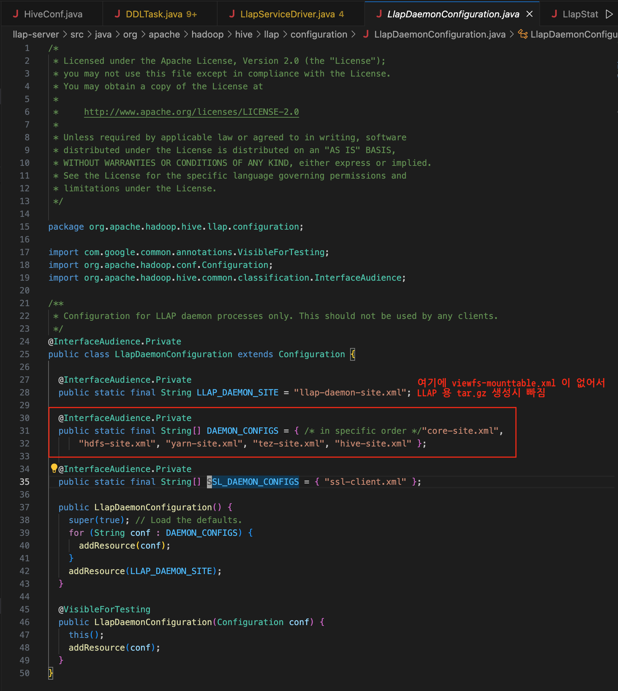

## hadoop-docker

* MacOS 환경에서 hadoop, hive, tez(w/ llap) 테스트를 위한 docker 구성

### Requirement
* lima

### lima 설치 및 환경 설정
* lima/README.md 참조

### hadoop pkg download
* hadoop pkg 를 ${HOME}/pkgs 밑에 download 하고 ${HOME}/app 밑에 symlink 생성

```
Usage)
   ./download.sh -p all|hadoop|hive|tez [-f]

  -p: package
  -f: force download
      default is not force download

   ./download.sh -p all
   ./download.sh -p all -f
   ./download.sh -p hadoop
   ./download.sh -p hadoop -f

host> ./download.sh -p all
host> tree -L 1 app
app
├── admin
├── apache-hive-3.1.3-bin
├── apache-maven-3.6.3
├── apache-tomcat -> apache-tomcat-9.0.91
├── apache-tomcat-9.0.91
├── conf
├── custom-tez-0.9.2-bin_with_hadoop_3.3.6
├── hadoop -> hadoop-3.3.6
├── hadoop-3.3.6
├── hive -> apache-hive-3.1.3-bin
├── maven -> apache-maven-3.6.3
├── mysql-connector -> mysql-connector-j-8.0.33
├── mysql-connector-j-8.0.33
├── pkgs
├── rebuild_share_tez.sh
├── replace_tez_hadoop_lib.sh
└── tez -> custom-tez-0.9.2-bin_with_hadoop_3.3.6

```

### hadoop 을 위한 hadoop/base docker 생성
```
lima> ./build.sh
lima> docker images
REPOSITORY                                      TAG       IMAGE ID       CREATED         SIZE
hadoop/base                                     latest    d60816074f98   7 hours ago     1.15GB
```
* 만약 생성시 실패하면 Dockerfile 등을 수정하고 rebuild (build 시 필요한 옵션은 다음 참조)

```
lima> cat build.sh
#!/bin/bash

docker build --rm=true -t hadoop/base .

# 옵션 설명
## --rm: true|false. 이미지 생성에 성공하면 임시 컨테이너 삭제 여부
## --no-cache: true|false. 이전 빌드에서 생성된 캐시 사용 여부
#docker build --no-cache=true --rm=true -t hadoop/base .
```

### hadoop cluster 생성/시작/중지/삭제
* docker-compose 이용

```
# 생성 + 시작 (이미 container 있으면 생성 없이 시작)
lima> docker-compose up # container 들의 log 를 다 출력 (Ctrl + c 하면 중지)
OR
lima> docker-compose up -d # detached mode

# 시작
lima> docker-compose start

# 중지
lima> docker-compose stop # 중지

# 삭제
lima> docker-compose down # 중지 + 삭제

# 재시작
lima> docker-compose restart

# 특정 container 모니터링
lima> docker-compose logs -t -f namenode # 특정 서비스에 대해서만 log 출력. -t log 에 timestamp 출력
```

### 기타 운영에 필요한 사항
#### docker-compose 로 생성된 docker images 정보 (mysql, elasticsearch, kibana, zookeeper)
```
lima> docker images
REPOSITORY                                      TAG       IMAGE ID       CREATED         SIZE
hadoop/base                                     latest    d60816074f98   7 hours ago     1.27GB
zookeeper                                       3.8.2     8e029f8ca1e5   11 months ago   290MB
mysql                                           8.0.33    a5e6f938c138   12 months ago   587MB
docker.elastic.co/kibana/kibana                 7.13.2    0d7fac58828d   3 years ago     1.51GB
docker.elastic.co/elasticsearch/elasticsearch   7.13.2    82ca179b201b   3 years ago     1.1GB
```

#### docker-compose 로 생성된 volume 관리
```
# volume 조회
lima> docker volume ls
DRIVER    VOLUME NAME
local     hadoop-docker_vol_dn
local     hadoop-docker_vol_es
local     hadoop-docker_vol_mysql
local     hadoop-docker_vol_nn
local     hadoop-docker_vol_yarn
local     hadoop-docker_vol_zk_data
local     hadoop-docker_vol_zk_datalog
local     hadoop-docker_vol_zk_logs

# 동적으로 생성된 사용하지 않는 volume 삭제
lima> docker volume prune
WARNING! This will remove anonymous local volumes not used by at least one container.
Are you sure you want to continue? [y/N] y
Total reclaimed space: 0B
```

#### docker 접속법
```
lima> ./attach.sh
Usage: ./attach.sh base|nn|yarn|hive|data01|etc01|zk01|mysql|es|kibana

## base: hadoop/base image (새로운 페키지 등을 추가할 때 테스트 환경으로 사용)
## nn: namenode
## yarn: resourcemanager, historyserver, timelineserver
## hive: hive-metastore(thrift), hive-server2, tomcat(for tez web ui)
## data01: datanode, nodemanager
## etc01: 예약 (아직 없음)
## mysql: mysql (현재 hive metastore)
## zk01: zookeeper
## es: elastic search
## kibana: kibana
```

#### host 에서 hadoop component 접근을 위한 필요한 사항
##### /etc/hosts 파일
```
## hadoop-docker
127.0.0.1   nn.hadoop-local yarn.hadoop-local hive.hadoop-local data01.hadoop-local es.hadoop-local kibana.hadoop-local mysql.hadoop-local zk01.hadoop-local
127.0.0.1   data01 yarn # for dfs.client.use.datanode.hostname on hdfs-site.xml
```

##### HADOOP_CONF_DIR
```
export HADOOP_CONF_DIR=${HOME}/app/conf/conf.hadoop.local
```
% ${HOME}은 hadoop_docker 의 위치를 각자 환경에 맞게 절대경로로 설정


#### 서버 정보
| Web UI      | URL                                                      |
|:------------|:---------------------------------------------------------|
|HDFS NN      |http://nn.hadoop-local:50070/dfshealth.html#tab-overview  |
|Yarn RM      |http://yarn.hadoop-local:8088/cluster                     |
|Yarn JH      |http://yarn.hadoop-local:19888/jobhistory                 |
|Yarn TLS     |http://yarn.hadoop-local:8188/applicationhistory          |
|Hive         |http://hive.hadoop-local:10002                            |
|Tez UI       |http://hive.hadoop-local:11100/tez-ui/                    |
|LLAP Monitor |http://data01.hadoop-local:15002                          |
|HDFS DN      |http://data01.hadoop-local:9864/datanode.html             |
|ES           |http://es.hadoop-local:9200/                              |
|Kibana       |http://kibana.hadoop-local:5601/app/home#/                |


#### Logs 정보
* host 의 /tmp/lima/logs 밑에 각종 로그 생성


#### cron 설정법
* ${HOME}/app/admin/hive/start_crond.sh 참조해서 서버의 해당 계정에 생성하고, docker-compose.yml 의 command 에 hive 부분 참조해서 등록
* Dockerfile 에서 등록하게 되면 모든 서버에서 동작해서 cron 이 필요한 서버에 등록하는 것으로 함


### TroubleShooting
#### Permission denied: user=test, access=EXECUTE, inode="/user":hdfs:hadoop:drwxrwx---
* 원인: /user 에 other 권한이 없어서 발생
* 조치: /user 에 other 권한 추가

```
lima> ./attach.sh yarn
[root@yarn /]# su - hdfs
Last login: 금  5월 31 18:02:49 KST 2024 on pts/0
[hdfs@yarn ~]$ hdfs dfs -chmod 1777 /user
WARNING: log4j.properties is not found. HADOOP_CONF_DIR may be incomplete.
2024-05-31 09:06:30,538 WARN  [main] util.NativeCodeLoader (NativeCodeLoader.java:<clinit>(60)) - Unable to load native-hadoop library for your platform... using builtin-java classes where applicable
[hdfs@yarn ~]$ hdfs dfs -ls /
WARNING: log4j.properties is not found. HADOOP_CONF_DIR may be incomplete.
2024-05-31 09:06:39,208 WARN  [main] util.NativeCodeLoader (NativeCodeLoader.java:<clinit>(60)) - Unable to load native-hadoop library for your platform... using builtin-java classes where applicable
Found 2 items
drwxrwxrwt   - hive hadoop          0 2024-05-31 08:47 /tmp
drwxrwxrwt   - hdfs hadoop          0 2024-05-31 08:20 /user
```

#### Permission denied: user=test, access=EXECUTE, inode="/user/history":hdfs:hadoop:drwxrwx---
* 원인: /user/history 에 other 권한이 없어서 발생
* 조치: /user/history 에 other 권한 추가

```
lima> ./attach.sh yarn
[root@yarn /]# su - hdfs
Last login: 금  5월 31 18:02:49 KST 2024 on pts/0
[hdfs@yarn ~]$ hdfs dfs -chmod 1777 /user/history
WARNING: log4j.properties is not found. HADOOP_CONF_DIR may be incomplete.
2024-05-31 09:06:30,538 WARN  [main] util.NativeCodeLoader (NativeCodeLoader.java:<clinit>(60)) - Unable to load native-hadoop library for your platform... using builtin-java classes where applicable
[hdfs@yarn ~]$ hdfs dfs -ls -d /user/history
WARNING: log4j.properties is not found. HADOOP_CONF_DIR may be incomplete.
2024-07-01 09:59:25,288 WARN  [main] util.NativeCodeLoader (NativeCodeLoader.java:<clinit>(60)) - Unable to load native-hadoop library for your platform... using builtin-java classes where applicable
drwxrwxrwt   - hdfs hadoop          0 2024-06-19 12:41 /user/history
```

#### Permission denied: user=anonymous, access=EXECUTE, inode="/user/history":hdfs:hadoop:drwxrwx--- 처럼 user 가 anonymous 인 이유?
* 원인: beeline 으로 접근시 user 를 지정한해줘서 발생
* 조치: beeline 에 `-n 유저명` 붙여주면 됨 (접근 권한은 위 참조)

#### test/hive/hive_llap.sh 에서 Error while processing statement: FAILED: Execution Error, return code 1 from org.apache.hadoop.hive.ql.exec.tez.TezTask (state=08S01,code=1)
* 원인: hdfs 의 /app/tez 에 app/tez/share 에 생성한 tar.gz 업로드 안한 경우
* 조치: README_for_tez.md 의 "4. hdfs 의 /app/tez 에 app/tez/share 에 생성한 tar.gz 업로드" 참고해서 tar.gz 업로드

#### yarn app -launch 실행시 The registered message body readers compatible with the MIME media type 에러
* 원인: yarn services 비활성일 경우 발생 (에러 메시지가 좀 애매모호함)
* 조치: yarn services 활성화

```
$> yarn app -launch 서비스명 서비스_Yarnfile
:
심각: A message body reader for Java class org.apache.hadoop.yarn.service.api.records.ServiceStatus, and Java type class org.apache.hadoop.yarn.service.api.records.ServiceStatus, and MIME media type application/octet-stream was not found
Jun 08, 2024 9:28:02 PM com.sun.jersey.api.client.ClientResponse getEntity
심각: The registered message body readers compatible with the MIME media type are:
application/octet-stream ->
:

# yarn services 활성화
$> cat yarn-site.xml
:
  <!-- HEAD of yarn services -->
  <property>
    <name>yarn.webapp.api-service.enable</name>
    <value>true</value>
    <description>
      Enable services rest api on ResourceManager.
      See: https://apache.github.io/hadoop/hadoop-yarn/hadoop-yarn-site/yarn-service/QuickStart.html
    </description>
  </property>
  <!-- TAIL of yarn services -->
:
```

#### managed table 의 단순 count(1) 조회시 0 으로 나올 경우
* 원인: managed table 의 데이터를 external table 처럼 그냥 데이터를 복사하면 발생
* 조치: 통계 갱신 필요

```
예)
hive> ANALYZE TABLE dataset.dataexpo_c116_text PARTITION (part_year='2008', part_month='01') COMPUTE STATISTICS;
```

#### org.apache.hadoop.mapred.YarnChild: Error running child : java.lang.OutOfMemoryError: Java heap space
* 원인: MR map 의 기본 Xmx 가 820m 인데 적어서 발생
* 조치: `set mapreduce.map.java.opts=-Xmx1024m;` 등으로 변경

```
# container 의 launch_container.sh 로그에서 변경된 설정 확인 가능
#!/bin/bash

set -o pipefail -e
:
exec /bin/bash -c "$JAVA_HOME/bin/java -Djava.net.preferIPv4Stack=true -Dhadoop.metrics.log.level=WARN  -Xmx1024m -Djava.io.tmpdir=$PWD/tmp -Dlog4j.configuration=container-log4j.properties -Dyarn.app.container.log.dir=/data/hadoop/yarn/containers/application_1719832294900_0002/container_1719832294900_0002_01_000002 -Dyarn.app.container.log.filesize=0 -Dhadoop.root.logger=INFO,CLA -Dhadoop.root.logfile=syslog org.apache.hadoop.mapred.YarnChild 172.20.0.8 34489 attempt_1719832294900_0002_m_000000_0 2 1>/data/hadoop/yarn/containers/application_1719832294900_0002/container_1719832294900_0002_01_000002/stdout 2>/data/hadoop/yarn/containers/application_1719832294900_0002/container_1719832294900_0002_01_000002/stderr "
```

#### hive, tez, hadoop, zookeeper 간 호환이 안될 경우
| Hive    | Tez            | Hadoop | Zookeeper |
|:--------|:---------------|:-------|:----------|
| 3.x     | 0.9.2 - 0.10.1 | 3.1.3  | 3.4.6     |
| 4.x     | 0.10.2 -       | 3.3.1  | 3.5.6     |

##### java.lang.NoSuchMethodError: org.apache.tez.dag.app.dag.TaskAttempt.getID()Lorg/apache/tez/dag/records/TezTaskAttemptID
* 원인: hive 와 tez 간 호환이 안될 경우 발생
* 조치: hive 에 맞는 tez 로 변경 혹은 custom 필요 (tez 0.10.2 일 때 발생해서 0.10.1 변경했으나 최종적으로는 TezSpillRecord 에러가 발생해서 0.9.2 로 변경)

```
2024-08-28 16:50:17,140 [ERROR] [TaskSchedulerEventHandlerThread] |rm.TaskSchedulerManager|: Error in handling event type S_TA_LAUNCH_REQUEST to the TaskScheduler
java.lang.NoSuchMethodError: org.apache.tez.dag.app.dag.TaskAttempt.getID()Lorg/apache/tez/dag/records/TezTaskAttemptID;
	at org.apache.hadoop.hive.llap.tezplugins.LlapTaskSchedulerService.getTaskAttemptId(LlapTaskSchedulerService.java:1117)
	at org.apache.hadoop.hive.llap.tezplugins.LlapTaskSchedulerService.allocateTask(LlapTaskSchedulerService.java:1070)
	at org.apache.tez.dag.app.rm.TaskSchedulerWrapper.allocateTask(TaskSchedulerWrapper.java:57)
	at org.apache.tez.dag.app.rm.TaskSchedulerManager.handleTaLaunchRequest(TaskSchedulerManager.java:528)
	at org.apache.tez.dag.app.rm.TaskSchedulerManager.handleEvent(TaskSchedulerManager.java:271)
	at org.apache.tez.dag.app.rm.TaskSchedulerManager$1.run(TaskSchedulerManager.java:685)
```

##### java.lang.NoSuchMethodError: com.google.common.base.Preconditions.checkArgument(ZLjava/lang/String;Ljava/lang/Object;)V
* 원인: tez 와 hadoop 간 호환이 안될 경우 발생
* 조치: tez/share/tez.tar.gz 의 hadoop lib 변경 (`app/replace_tez_hadoop_lib.sh, app/rebuild_share_tez.sh` 를 이용해서 변경)

```
java.lang.NoSuchMethodError: com.google.common.base.Preconditions.checkArgument(ZLjava/lang/String;Ljava/lang/Object;)V
	at org.apache.hadoop.conf.Configuration.set(Configuration.java:1357)
	at org.apache.hadoop.conf.Configuration.set(Configuration.java:1338)
	at org.apache.tez.common.TezUtilsInternal.addUserSpecifiedTezConfiguration(TezUtilsInternal.java:84)
	at org.apache.tez.dag.app.DAGAppMaster.main(DAGAppMaster.java:2377)
```

##### java.lang.NoSuchMethodError: org.apache.hadoop.fs.FsTracer.get(Lorg/apache/hadoop/conf/Configuration;)Lorg/apache/htrace/core/Tracer
* 원인: tez 와 hadoop 간 호환이 안될 경우 발생
* 조치: tez/lib 의 hadoop lib 변경 (`app/replace_tez_hadoop_lib.sh` 를 이용해서 변경)

```
java.lang.NoSuchMethodError: org.apache.hadoop.fs.FsTracer.get(Lorg/apache/hadoop/conf/Configuration;)Lorg/apache/htrace/core/Tracer;
    at org.apache.hadoop.hdfs.DFSClient.<init>(DFSClient.java:323)
    at org.apache.hadoop.hdfs.DFSClient.<init>(DFSClient.java:308)
    at org.apache.hadoop.hdfs.DistributedFileSystem.initDFSClient(DistributedFileSystem.java:201)
    at org.apache.hadoop.hdfs.DistributedFileSystem.initialize(DistributedFileSystem.java:186)
    at org.apache.hadoop.fs.FileSystem.createFileSystem(FileSystem.java:3572)
    at org.apache.hadoop.fs.FileSystem.access$300(FileSystem.java:174)
    at org.apache.hadoop.fs.FileSystem$Cache.getInternal(FileSystem.java:3673)
    at org.apache.hadoop.fs.FileSystem$Cache.get(FileSystem.java:3624)
    at org.apache.hadoop.fs.FileSystem.get(FileSystem.java:557)
    at org.apache.hadoop.fs.Path.getFileSystem(Path.java:365)
    at org.apache.hadoop.hive.llap.io.encoded.SerDeEncodedDataReader.<init>(SerDeEncodedDataReader.java:214)
```

##### java.lang.NoSuchMethodError: org.apache.zookeeper.server.quorum.flexible.QuorumMaj.<init>(Ljava/util/Map;)V
* 원인: hive 와 zookeeper 간 버전이 안 맞을 경우 발생 (Yarn 로그 말고, Yarn Node 의 LLAP Daemon 로그에서 확인 가능)
* 조치: hive 의 zookeeper 버전을 변경 (보통 hadoop 의 zookeeper 버전으로 맞추면 됨)

```
2024-08-29T14:54:09,000 ERROR [Listener at 0.0.0.0/15004 ()] org.apache.hadoop.hive.llap.daemon.impl.LlapDaemon: Failed to start LLAP Daemon with exception
java.lang.NoSuchMethodError: org.apache.zookeeper.server.quorum.flexible.QuorumMaj.<init>(Ljava/util/Map;)V
        at org.apache.curator.framework.imps.EnsembleTracker.<init>(EnsembleTracker.java:57) ~[curator-framework-4.2.0.jar:4.2.0]
        at org.apache.curator.framework.imps.CuratorFrameworkImpl.<init>(CuratorFrameworkImpl.java:159) ~[curator-framework-4.2.0.jar:4.2.0]
        at org.apache.curator.framework.CuratorFrameworkFactory$Builder.build(CuratorFrameworkFactory.java:165) ~[curator-framework-4.2.0.jar:4.2.0]
        at org.apache.hadoop.hive.registry.impl.ZkRegistryBase.getZookeeperClient(ZkRegistryBase.java:235) ~[hive-exec-3.1.3.jar:3.1.3]
        at org.apache.hadoop.hive.registry.impl.ZkRegistryBase.<init>(ZkRegistryBase.java:179) ~[hive-exec-3.1.3.jar:3.1.3]
        at org.apache.hadoop.hive.llap.registry.impl.LlapZookeeperRegistryImpl.<init>(LlapZookeeperRegistryImpl.java:78) ~[hive-exec-3.1.3.jar:3.1.3]
        at org.apache.hadoop.hive.llap.registry.impl.LlapRegistryService.serviceInit(LlapRegistryService.java:91) ~[hive-exec-3.1.3.jar:3.1.3]
        at org.apache.hadoop.service.AbstractService.init(AbstractService.java:164) ~[hadoop-common-3.3.5.jar:?]
        at org.apache.hadoop.hive.llap.daemon.impl.LlapDaemon.serviceStart(LlapDaemon.java:432) ~[hive-llap-server-3.1.3.jar:3.1.3]
        at org.apache.hadoop.service.AbstractService.start(AbstractService.java:194) ~[hadoop-common-3.3.5.jar:?]
        at org.apache.hadoop.hive.llap.daemon.impl.LlapDaemon.main(LlapDaemon.java:541) [hive-llap-server-3.1.3.jar:3.1.3]
```

##### Caused by: java.lang.ClassNotFoundException: org.apache.hadoop.thirdparty.com.google.common.collect.Interners
* 원인: hadoop 과 tez 의 hadoop-shaded-guava, hadoop-shaded-protobuf_3_7 버전이 안 맞을 경우 (LLAPDaemon 로그에서 발생할 수 있음)
* 조치: tez/share/tez.tar.gz 의 hadoop lib 변경 (`app/replace_tez_hadoop_lib.sh, app/rebuild_share_tez.sh` 를 이용해서 변경)

```
Caused by: java.lang.ClassNotFoundException: org.apache.hadoop.thirdparty.com.google.common.collect.Interners
        at java.net.URLClassLoader.findClass(URLClassLoader.java:387) ~[?:1.8.0_422]
        at java.lang.ClassLoader.loadClass(ClassLoader.java:418) ~[?:1.8.0_422]
        at sun.misc.Launcher$AppClassLoader.loadClass(Launcher.java:352) ~[?:1.8.0_422]
        at java.lang.ClassLoader.loadClass(ClassLoader.java:351) ~[?:1.8.0_422]
        ... 19 more
```

##### java.lang.NoClassDefFoundError: Could not initialize class org.xerial.snappy.Snappy
* 원인: hadoop 과 tez 의 snappy 버전이 안 맞을 경우 (LLAPDaemon 로그에서 발생할 수 있음)
* 조치: tez/share/tez.tar.gz 의 hadoop lib 변경 (`app/replace_tez_hadoop_lib.sh, app/rebuild_share_tez.sh` 를 이용해서 변경)

```
java.lang.NoClassDefFoundError: Could not initialize class org.xerial.snappy.Snappy
        at org.xerial.snappy.SnappyInputStream.hasNextChunk(SnappyInputStream.java:351)
        at org.xerial.snappy.SnappyInputStream.rawRead(SnappyInputStream.java:159)
        at org.xerial.snappy.SnappyInputStream.read(SnappyInputStream.java:142)
        at java.io.InputStream.read(InputStream.java:101)
        at com.google.protobuf.CodedInputStream.refillBuffer(CodedInputStream.java:737)
        at com.google.protobuf.CodedInputStream.isAtEnd(CodedInputStream.java:701)
        at com.google.protobuf.CodedInputStream.readTag(CodedInputStream.java:99)
        at org.apache.tez.dag.api.records.DAGProtos$ConfigurationProto.<init>(DAGProtos.java:19294)
```

##### Caused by: java.lang.NoSuchMethodError: org.eclipse.jetty.server.session.SessionHandler.setHttpOnly(Z)V
* 원인: hadoop 과 tez 의 jetty 버전이 안 맞을 경우 발생
* 조치: tez/lib, tez/share/tez.tar.gz 의 jetty 를 삭제하면 hadoop 버전을 사용하게 됨 (`app/replace_tez_hadoop_lib.sh, app/rebuild_share_tez.sh` 를 이용해서 변경)

```
Caused by: java.lang.NoSuchMethodError: org.eclipse.jetty.server.session.SessionHandler.setHttpOnly(Z)V
	at org.apache.hadoop.http.HttpServer2.initializeWebServer(HttpServer2.java:717)
	at org.apache.hadoop.http.HttpServer2.<init>(HttpServer2.java:697)
	at org.apache.hadoop.http.HttpServer2.<init>(HttpServer2.java:129)
	at org.apache.hadoop.http.HttpServer2$Builder.build(HttpServer2.java:478)
	at org.apache.hadoop.yarn.webapp.WebApps$Builder.build(WebApps.java:372)
	at org.apache.hadoop.yarn.webapp.WebApps$Builder.start(WebApps.java:465)
	at org.apache.hadoop.yarn.webapp.WebApps$Builder.start(WebApps.java:461)
	at org.apache.tez.dag.app.web.WebUIService.serviceStart(WebUIService.java:94)
	at org.apache.hadoop.service.AbstractService.start(AbstractService.java:194)
	at org.apache.tez.dag.app.DAGAppMaster$ServiceWithDependency.start(DAGAppMaster.java:1865)
	at org.apache.tez.dag.app.DAGAppMaster$ServiceThread.run(DAGAppMaster.java:1886)
```

##### java.lang.NoSuchMethodError: com.sun.jersey.api.client.ClientResponse.getStatusInfo()Ljavax/ws/rs/core/Response$StatusType;
* 원인: hadoop 과 tez 의 jersey 버전이 안 맞을 경우 발생
* 조치: tez/lib, tez/share/tez.tar.gz 의 jersey 버전을 hadoop lib 으로 변경 (`app/replace_tez_hadoop_lib.sh, app/rebuild_share_tez.sh` 를 이용해서 변경)

```
java.lang.NoSuchMethodError: com.sun.jersey.api.client.ClientResponse.getStatusInfo()Ljavax/ws/rs/core/Response$StatusType;
	at org.apache.hadoop.yarn.client.api.impl.TimelineWriter.doPosting(TimelineWriter.java:129)
	at org.apache.hadoop.yarn.client.api.impl.TimelineWriter.putEntities(TimelineWriter.java:92)
	at org.apache.hadoop.yarn.client.api.impl.TimelineClientImpl.putEntities(TimelineClientImpl.java:178)
	at org.apache.tez.dag.history.logging.ats.ATSHistoryLoggingService.handleEvents(ATSHistoryLoggingService.java:354)
	at org.apache.tez.dag.history.logging.ats.ATSHistoryLoggingService.serviceStop(ATSHistoryLoggingService.java:246)
	at org.apache.hadoop.service.AbstractService.stop(AbstractService.java:220)
	at org.apache.hadoop.service.ServiceOperations.stop(ServiceOperations.java:54)
	at org.apache.hadoop.service.ServiceOperations.stopQuietly(ServiceOperations.java:102)
	at org.apache.hadoop.service.CompositeService.stop(CompositeService.java:159)
	at org.apache.hadoop.service.CompositeService.serviceStop(CompositeService.java:133)
	at org.apache.tez.dag.history.HistoryEventHandler.serviceStop(HistoryEventHandler.java:116)
	at org.apache.hadoop.service.AbstractService.stop(AbstractService.java:220)
	at org.apache.hadoop.service.ServiceOperations.stop(ServiceOperations.java:54)
	at org.apache.hadoop.service.ServiceOperations.stopQuietly(ServiceOperations.java:102)
	at org.apache.hadoop.service.ServiceOperations.stopQuietly(ServiceOperations.java:67)
	at org.apache.tez.dag.app.DAGAppMaster.stopServices(DAGAppMaster.java:1976)
	at org.apache.tez.dag.app.DAGAppMaster.serviceStop(DAGAppMaster.java:2196)
	at org.apache.hadoop.service.AbstractService.stop(AbstractService.java:220)
	at org.apache.hadoop.service.ServiceOperations.stop(ServiceOperations.java:54)
	at org.apache.hadoop.service.ServiceOperations.stopQuietly(ServiceOperations.java:102)
	at org.apache.hadoop.service.AbstractService.start(AbstractService.java:202)
	at org.apache.tez.dag.app.DAGAppMaster$9.run(DAGAppMaster.java:2663)
	at java.security.AccessController.doPrivileged(Native Method)
	at javax.security.auth.Subject.doAs(Subject.java:422)
	at org.apache.hadoop.security.UserGroupInformation.doAs(UserGroupInformation.java:1899)
	at org.apache.tez.dag.app.DAGAppMaster.initAndStartAppMaster(DAGAppMaster.java:2659)
	at org.apache.tez.dag.app.DAGAppMaster.main(DAGAppMaster.java:2464)
```

##### java.lang.NoSuchMethodError: javax.servlet.ServletContext.createFilter(Ljava/lang/Class;)
* 원인: tez/lib 에 javax.servlet-api 가 없어서 발생
* 조치: tez/lib 에 hadoop lib 의 javax.servlet-api 복사 (`app/replace_tez_hadoop_lib.sh` 를 이용해서 복사)

```
MultiException[java.lang.NoSuchMethodError: javax.servlet.ServletContext.createFilter(Ljava/lang/Class;)Ljavax/servlet/Filter;, java.lang.NoSuchMethodError: javax.servlet.ServletContext.createFilter(Ljava/lang/Class;)Ljavax/servlet/Filter;]
	at org.eclipse.jetty.util.MultiException.ifExceptionThrow(MultiException.java:122)
	at org.eclipse.jetty.server.Server.doStart(Server.java:413)
	at org.eclipse.jetty.util.component.AbstractLifeCycle.start(AbstractLifeCycle.java:73)
	at org.apache.hadoop.http.HttpServer2.start(HttpServer2.java:1301)
	at org.apache.hadoop.yarn.webapp.WebApps$Builder.start(WebApps.java:472)
	at org.apache.hadoop.yarn.webapp.WebApps$Builder.start(WebApps.java:461)
	at org.apache.tez.dag.app.web.WebUIService.serviceStart(WebUIService.java:94)
	at org.apache.hadoop.service.AbstractService.start(AbstractService.java:194)
	at org.apache.tez.dag.app.DAGAppMaster$ServiceWithDependency.start(DAGAppMaster.java:1865)
	at org.apache.tez.dag.app.DAGAppMaster$ServiceThread.run(DAGAppMaster.java:1886)
	Suppressed: java.lang.NoSuchMethodError: javax.servlet.ServletContext.createFilter(Ljava/lang/Class;)Ljavax/servlet/Filter;
		at org.eclipse.jetty.servlet.FilterHolder.initialize(FilterHolder.java:123)
		at org.eclipse.jetty.servlet.ServletHandler.lambda$initialize$0(ServletHandler.java:750)
		at java.util.Spliterators$ArraySpliterator.forEachRemaining(Spliterators.java:948)
		at java.util.stream.Streams$ConcatSpliterator.forEachRemaining(Streams.java:742)
		at java.util.stream.ReferencePipeline$Head.forEach(ReferencePipeline.java:647)
		at org.eclipse.jetty.servlet.ServletHandler.initialize(ServletHandler.java:774)
		at org.eclipse.jetty.servlet.ServletContextHandler.startContext(ServletContextHandler.java:379)
		at org.eclipse.jetty.server.handler.ContextHandler.doStart(ContextHandler.java:916)
		at org.eclipse.jetty.servlet.ServletContextHandler.doStart(ServletContextHandler.java:288)
		at org.eclipse.jetty.util.component.AbstractLifeCycle.start(AbstractLifeCycle.java:73)
		at org.eclipse.jetty.util.component.ContainerLifeCycle.start(ContainerLifeCycle.java:169)
		at org.eclipse.jetty.util.component.ContainerLifeCycle.doStart(ContainerLifeCycle.java:117)
		at org.eclipse.jetty.server.handler.AbstractHandler.doStart(AbstractHandler.java:97)
		at org.eclipse.jetty.util.component.AbstractLifeCycle.start(AbstractLifeCycle.java:73)
		at org.eclipse.jetty.util.component.ContainerLifeCycle.start(ContainerLifeCycle.java:169)
		at org.eclipse.jetty.util.component.ContainerLifeCycle.doStart(ContainerLifeCycle.java:117)
		at org.eclipse.jetty.server.handler.AbstractHandler.doStart(AbstractHandler.java:97)
		at org.eclipse.jetty.util.component.AbstractLifeCycle.start(AbstractLifeCycle.java:73)
		at org.eclipse.jetty.util.component.ContainerLifeCycle.start(ContainerLifeCycle.java:169)
		at org.eclipse.jetty.server.Server.start(Server.java:423)
		at org.eclipse.jetty.util.component.ContainerLifeCycle.doStart(ContainerLifeCycle.java:110)
		at org.eclipse.jetty.server.handler.AbstractHandler.doStart(AbstractHandler.java:97)
		at org.eclipse.jetty.server.Server.doStart(Server.java:387)
		... 8 more
	Suppressed: java.lang.NoSuchMethodError: javax.servlet.ServletContext.createFilter(Ljava/lang/Class;)Ljavax/servlet/Filter;
		at org.eclipse.jetty.servlet.FilterHolder.initialize(FilterHolder.java:123)
		at org.eclipse.jetty.servlet.ServletHandler.lambda$initialize$0(ServletHandler.java:750)
		at java.util.Spliterators$ArraySpliterator.forEachRemaining(Spliterators.java:948)
		at java.util.stream.Streams$ConcatSpliterator.forEachRemaining(Streams.java:742)
		at java.util.stream.ReferencePipeline$Head.forEach(ReferencePipeline.java:647)
		at org.eclipse.jetty.servlet.ServletHandler.initialize(ServletHandler.java:774)
		at org.eclipse.jetty.servlet.ServletContextHandler.startContext(ServletContextHandler.java:379)
		at org.eclipse.jetty.server.handler.ContextHandler.doStart(ContextHandler.java:916)
		at org.eclipse.jetty.servlet.ServletContextHandler.doStart(ServletContextHandler.java:288)
		at org.eclipse.jetty.util.component.AbstractLifeCycle.start(AbstractLifeCycle.java:73)
		at org.eclipse.jetty.util.component.ContainerLifeCycle.start(ContainerLifeCycle.java:169)
		at org.eclipse.jetty.util.component.ContainerLifeCycle.doStart(ContainerLifeCycle.java:117)
		at org.eclipse.jetty.server.handler.AbstractHandler.doStart(AbstractHandler.java:97)
		at org.eclipse.jetty.util.component.AbstractLifeCycle.start(AbstractLifeCycle.java:73)
		at org.eclipse.jetty.util.component.ContainerLifeCycle.start(ContainerLifeCycle.java:169)
		at org.eclipse.jetty.util.component.ContainerLifeCycle.doStart(ContainerLifeCycle.java:117)
		at org.eclipse.jetty.server.handler.AbstractHandler.doStart(AbstractHandler.java:97)
		at org.eclipse.jetty.util.component.AbstractLifeCycle.start(AbstractLifeCycle.java:73)
		at org.eclipse.jetty.util.component.ContainerLifeCycle.start(ContainerLifeCycle.java:169)
		at org.eclipse.jetty.server.Server.start(Server.java:423)
		at org.eclipse.jetty.util.component.ContainerLifeCycle.doStart(ContainerLifeCycle.java:110)
		at org.eclipse.jetty.server.handler.AbstractHandler.doStart(AbstractHandler.java:97)
		at org.eclipse.jetty.server.Server.doStart(Server.java:387)
		... 8 more
Caused by: [CIRCULAR REFERENCE: java.lang.NoSuchMethodError: javax.servlet.ServletContext.createFilter(Ljava/lang/Class;)Ljavax/servlet/Filter;]
```

##### Caused by: java.lang.ClassNotFoundException: com.ctc.wstx.io.InputBootstrapper
* 원인: tez/share/tez.tar.gz 에 woodstox-core 가 없어서 발생
* 조치: tez/share/tez.tar.gz 에 hadoop lib 의 woodstox-core 복사 (`app/replace_tez_hadoop_lib.sh, app/rebuild_share_tez.sh` 를 이용해서 복사)

```
Caused by: java.lang.ClassNotFoundException: com.ctc.wstx.io.InputBootstrapper
        at java.net.URLClassLoader.findClass(URLClassLoader.java:387) ~[?:1.8.0_422]
        at java.lang.ClassLoader.loadClass(ClassLoader.java:418) ~[?:1.8.0_422]
        at sun.misc.Launcher$AppClassLoader.loadClass(Launcher.java:352) ~[?:1.8.0_422]
        at java.lang.ClassLoader.loadClass(ClassLoader.java:351) ~[?:1.8.0_422]
```

##### Caused by: java.lang.ClassNotFoundException: org.codehaus.stax2.XMLInputFactory2
* 원인: tez/share/tez.tar.gz 에 stax2-api 가 없어서 발생
* 조치: tez/share/tez.tar.gz 에 hadoop lib 의 stax2-api 복사 (`app/replace_tez_hadoop_lib.sh, app/rebuild_share_tez.sh` 를 이용해서 복사)

```
Caused by: java.lang.ClassNotFoundException: org.codehaus.stax2.XMLInputFactory2
        at java.net.URLClassLoader.findClass(URLClassLoader.java:387) ~[?:1.8.0_422]
        at java.lang.ClassLoader.loadClass(ClassLoader.java:418) ~[?:1.8.0_422]
        at sun.misc.Launcher$AppClassLoader.loadClass(Launcher.java:352) ~[?:1.8.0_422]
        at java.lang.ClassLoader.loadClass(ClassLoader.java:351) ~[?:1.8.0_422]
        ... 14 more
```

##### Caused by: java.lang.ClassNotFoundException: org.apache.commons.configuration2.Configuration
* 원인: tez/share/tez.tar.gz 에 commons-configuration2 가 없어서 발생 (0.9.2 에는 commons-configuration 가 있는데 hadoop 3.3.6 에서는 commons-configuration2 사용)
* 조치: tez/share/tez.tar.gz 에 hadoop lib 의 commons-configuration2 복사 (`app/replace_tez_hadoop_lib.sh, app/rebuild_share_tez.sh` 를 이용해서 복사)

```
Caused by: java.lang.ClassNotFoundException: org.apache.commons.configuration2.Configuration
        at java.net.URLClassLoader.findClass(URLClassLoader.java:387) ~[?:1.8.0_422]
        at java.lang.ClassLoader.loadClass(ClassLoader.java:418) ~[?:1.8.0_422]
        at sun.misc.Launcher$AppClassLoader.loadClass(Launcher.java:352) ~[?:1.8.0_422]
        at java.lang.ClassLoader.loadClass(ClassLoader.java:351) ~[?:1.8.0_422]
        ... 6 more
```

##### Caused by: java.lang.ClassNotFoundException: com.fasterxml.jackson.core.JsonProcessingException
* 원인: hadoop 과 tez 의 jackson 버전이 안 맞을 경우 발생
* 조치: tez/share/tez.tar.gz 에 jackson 버전을 hadoop lib 으로 변경 (`app/replace_tez_hadoop_lib.sh, app/rebuild_share_tez.sh` 를 이용해서 복사)

```
Caused by: java.lang.ClassNotFoundException: com.fasterxml.jackson.core.JsonProcessingException
        at java.net.URLClassLoader.findClass(URLClassLoader.java:387) ~[?:1.8.0_422]
        at java.lang.ClassLoader.loadClass(ClassLoader.java:418) ~[?:1.8.0_422]
        at sun.misc.Launcher$AppClassLoader.loadClass(Launcher.java:352) ~[?:1.8.0_422]
        at java.lang.ClassLoader.loadClass(ClassLoader.java:351) ~[?:1.8.0_422]
        ... 7 more
```

##### Caused by: java.lang.ClassNotFoundException: org.apache.curator.framework.api.ErrorListenerPathAndBytesable
* 원인: hive 와 tez 의 curator 버전이 안 맞을 경우 발생
* 조치: tez/share/tez.tar.gz 에 curator 버전을 hive lib 으로 변경 (`app/replace_tez_hadoop_lib.sh, app/rebuild_share_tez.sh` 를 이용해서 복사)

```
Caused by: java.lang.ClassNotFoundException: org.apache.curator.framework.api.ErrorListenerPathAndBytesable
        at java.net.URLClassLoader.findClass(URLClassLoader.java:387) ~[?:1.8.0_422]
        at java.lang.ClassLoader.loadClass(ClassLoader.java:418) ~[?:1.8.0_422]
        at sun.misc.Launcher$AppClassLoader.loadClass(Launcher.java:352) ~[?:1.8.0_422]
        at java.lang.ClassLoader.loadClass(ClassLoader.java:351) ~[?:1.8.0_422]
        ... 9 more
```

##### Caused by: java.lang.ClassNotFoundException: org.apache.commons.text.lookup.StringLookupFactory
* 원인: tez/share/tez.tar.gz 에 commons-text 가 없어서 발생
* 조치: tez/share/tez.tar.gz 에 hadoop lib 의 commons-text 복사 (`app/replace_tez_hadoop_lib.sh, app/rebuild_share_tez.sh` 를 이용해서 복사)

```
Caused by: java.lang.ClassNotFoundException: org.apache.commons.text.lookup.StringLookupFactory
        at java.net.URLClassLoader.findClass(URLClassLoader.java:387) ~[?:1.8.0_422]
        at java.lang.ClassLoader.loadClass(ClassLoader.java:418) ~[?:1.8.0_422]
        at sun.misc.Launcher$AppClassLoader.loadClass(Launcher.java:352) ~[?:1.8.0_422]
        at java.lang.ClassLoader.loadClass(ClassLoader.java:351) ~[?:1.8.0_422]
        ... 17 more
```

##### Caused by: java.lang.NoSuchMethodError: org.apache.tez.runtime.library.common.sort.impl.TezSpillRecord.<init>(Lorg/apache/hadoop/fs/Path;Lorg/apache/hadoop/conf/Configuration;Ljava/lang/String;)V
* 원인: hive 와 tez 간 호환이 안될 경우 발생 (LLAP Daemon 로그에서 확인 가능)
* 조치: hive 에 맞는 tez 로 변경 혹은 custom 필요 (tez 0.10.1 일 때 발생해서 0.9.2 변경)

```
Caused by: java.lang.NoSuchMethodError: org.apache.tez.runtime.library.common.sort.impl.TezSpillRecord.<init>(Lorg/apache/hadoop/fs/Path;Lorg/apache/hadoop/conf/Configuration;Ljava/lang/String;)V
	at org.apache.hadoop.hive.llap.shufflehandler.IndexCache.readIndexFileToCache(IndexCache.java:121) ~[hive-llap-server-3.1.3.jar:3.1.3]
	... 33 more
```
##### Hive 에서 MR 처리시 org.apache.hadoop.hive.ql.exec.mr.MapRedTask. HADOOP_CLASSPATH (state=08S01,code=-101) 발생
* 원인: tez 의 hadoop lib 와 실제 hadoop lib 버전이 안 맞을 경우 발생
* 조치: tez 의 hadoop lib 를 삭제하고 실제 hadoop lib 으로 맞춤
* 참조: https://118k.tistory.com/1209

#### Caused by: java.io.IOException: ViewFs: Cannot initialize: Empty Mount table in config for viewfs://devdic/
* 원인: viewfs 를 사용하면서 viewfs mount 정보를 core-site.xml 에서 관리 안하고 별도 파일(예: viewfs-mounttable.xml 등)으로 관리할 때 LLAP 용 tar.gz 에 core-site.xml 만 복사되면서 발생

* 조치: LLAP 용 tar.gz 생성시 별도 파일(예: viewfs-mounttable.xml 등)도 포함될 수 있도록 수정 (`hive@hive:/opt/admin/hive/llap/llap_generate_with_viewfs-mounttable.sh` 를 이용해서 생성)

```
Caused by: java.io.IOException: ViewFs: Cannot initialize: Empty Mount table in config for viewfs://devdic/
        at org.apache.hadoop.fs.viewfs.InodeTree.<init>(InodeTree.java:683)
        at org.apache.hadoop.fs.viewfs.ViewFileSystem$1.<init>(ViewFileSystem.java:331)
        at org.apache.hadoop.fs.viewfs.ViewFileSystem.initialize(ViewFileSystem.java:330)
        at org.apache.hadoop.fs.FileSystem.createFileSystem(FileSystem.java:3611)
        at org.apache.hadoop.fs.FileSystem.access$300(FileSystem.java:174)
        at org.apache.hadoop.fs.FileSystem$Cache.getInternal(FileSystem.java:3712)
        at org.apache.hadoop.fs.FileSystem$Cache.get(FileSystem.java:3663)
        at org.apache.hadoop.fs.FileSystem.get(FileSystem.java:557)
        at org.apache.hadoop.fs.Path.getFileSystem(Path.java:365)
        at org.apache.hadoop.hive.llap.io.encoded.SerDeEncodedDataReader.<init>(SerDeEncodedDataReader.java:214)
        at org.apache.hadoop.hive.llap.io.decode.GenericColumnVectorProducer.createReadPipeline(GenericColumnVectorProducer.java:100)
        at org.apache.hadoop.hive.llap.io.api.impl.LlapRecordReader.<init>(LlapRecordReader.java:189)
        at org.apache.hadoop.hive.llap.io.api.impl.LlapRecordReader.create(LlapRecordReader.java:122)
        at org.apache.hadoop.hive.llap.io.api.impl.LlapInputFormat.getRecordReader(LlapInputFormat.java:109)
        ... 28 more
```

#### java.lang.IllegalStateException: Invalid configuration. ExecutionContext for Map 1 specifies task scheduler as LLAP which is not part of the ServicePluginDescriptor
* 원인: tez.session.am.dag.submit.timeout.secs 가 너무 짧을 경우 발생
* 조치: tez.session.am.dag.submit.timeout.secs 시간을 늘려줌 (예: 60)

```
2024-10-08T17:40:30,821 ERROR [HiveServer2-Background-Pool: Thread-77] exec.Task (TezTask.java:execute(284)): Failed to execute tez graph.
java.lang.IllegalStateException: Invalid configuration. ExecutionContext for Map 1 specifies task scheduler as LLAP which is not part of the ServicePluginDescriptor
        at org.apache.tez.dag.api.DAG.verifyExecutionContext(DAG.java:1151) ~[tez-api-0.9.2.jar:0.9.2]
        at org.apache.tez.dag.api.DAG.createDag(DAG.java:968) ~[tez-api-0.9.2.jar:0.9.2]
        at org.apache.tez.client.TezClientUtils.prepareAndCreateDAGPlan(TezClientUtils.java:745) ~[tez-api-0.9.2.jar:0.9.2]
        at org.apache.tez.client.TezClient.submitDAGSession(TezClient.java:650) ~[tez-api-0.9.2.jar:0.9.2]
        at org.apache.tez.client.TezClient.submitDAG(TezClient.java:588) ~[tez-api-0.9.2.jar:0.9.2]
        at org.apache.hadoop.hive.ql.exec.tez.TezTask.submit(TezTask.java:553) ~[hive-exec-3.1.3.jar:3.1.3]
        at org.apache.hadoop.hive.ql.exec.tez.TezTask.execute(TezTask.java:216) [hive-exec-3.1.3.jar:3.1.3]
        at org.apache.hadoop.hive.ql.exec.Task.executeTask(Task.java:205) [hive-exec-3.1.3.jar:3.1.3]
        at org.apache.hadoop.hive.ql.exec.TaskRunner.runSequential(TaskRunner.java:97) [hive-exec-3.1.3.jar:3.1.3]
        at org.apache.hadoop.hive.ql.Driver.launchTask(Driver.java:2664) [hive-exec-3.1.3.jar:3.1.3]
        at org.apache.hadoop.hive.ql.Driver.execute(Driver.java:2335) [hive-exec-3.1.3.jar:3.1.3]
        at org.apache.hadoop.hive.ql.Driver.runInternal(Driver.java:2011) [hive-exec-3.1.3.jar:3.1.3]
        at org.apache.hadoop.hive.ql.Driver.run(Driver.java:1709) [hive-exec-3.1.3.jar:3.1.3]
        at org.apache.hadoop.hive.ql.Driver.run(Driver.java:1703) [hive-exec-3.1.3.jar:3.1.3]
        at org.apache.hadoop.hive.ql.reexec.ReExecDriver.run(ReExecDriver.java:157) [hive-exec-3.1.3.jar:3.1.3]
        at org.apache.hive.service.cli.operation.SQLOperation.runQuery(SQLOperation.java:224) [hive-service-3.1.3.jar:3.1.3]
        at org.apache.hive.service.cli.operation.SQLOperation.access$700(SQLOperation.java:87) [hive-service-3.1.3.jar:3.1.3]
        at org.apache.hive.service.cli.operation.SQLOperation$BackgroundWork$1.run(SQLOperation.java:316) [hive-service-3.1.3.jar:3.1.3]
        at java.security.AccessController.doPrivileged(Native Method) ~[?:1.8.0_372]
        at javax.security.auth.Subject.doAs(Subject.java:422) [?:1.8.0_372]
        at org.apache.hadoop.security.UserGroupInformation.doAs(UserGroupInformation.java:1899) [hadoop-common-3.3.6.jar:?]
        at org.apache.hive.service.cli.operation.SQLOperation$BackgroundWork.run(SQLOperation.java:329) [hive-service-3.1.3.jar:3.1.3]
        at java.util.concurrent.Executors$RunnableAdapter.call(Executors.java:511) [?:1.8.0_372]
        at java.util.concurrent.FutureTask.run(FutureTask.java:266) [?:1.8.0_372]
        at java.util.concurrent.ThreadPoolExecutor.runWorker(ThreadPoolExecutor.java:1149) [?:1.8.0_372]
        at java.util.concurrent.ThreadPoolExecutor$Worker.run(ThreadPoolExecutor.java:624) [?:1.8.0_372]
        at java.lang.Thread.run(Thread.java:750) [?:1.8.0_372]
```

#### tez.use.cluster.hadoop-libs = false 일 때 필요한 hadoop-libs 이 없어서 발생하는 에러
##### Caused by: java.lang.ClassNotFoundException: javax.ws.rs.ext.MessageBodyReader
* 원인: tez/share/tez.tar.gz 에 jsr311-api 가 없어서 발생
* 조치: tez/share/tez.tar.gz 에 hadoop lib 의 jsr311-api 복사 (`app/replace_tez_hadoop_lib.sh, app/rebuild_share_tez.sh` 를 이용해서 복사)

```
Caused by: java.lang.ClassNotFoundException: javax.ws.rs.ext.MessageBodyReader
	at java.net.URLClassLoader.findClass(URLClassLoader.java:387)
	at java.lang.ClassLoader.loadClass(ClassLoader.java:418)
	at sun.misc.Launcher$AppClassLoader.loadClass(Launcher.java:352)
	at java.lang.ClassLoader.loadClass(ClassLoader.java:351)
	... 67 more
```

##### Caused by: java.lang.ClassNotFoundException: org.eclipse.jetty.servlet.ServletContextHandler
* 원인: tez/share/tez.tar.gz 에 jetty-servlet 가 없어서 발생
* 조치: tez/share/tez.tar.gz 에 hadoop lib 의 jetty-servlet 복사 (`app/replace_tez_hadoop_lib.sh, app/rebuild_share_tez.sh` 를 이용해서 복사)

```
Caused by: java.lang.ClassNotFoundException: org.eclipse.jetty.servlet.ServletContextHandler
	at java.net.URLClassLoader.findClass(URLClassLoader.java:387)
	at java.lang.ClassLoader.loadClass(ClassLoader.java:418)
	at sun.misc.Launcher$AppClassLoader.loadClass(Launcher.java:352)
	at java.lang.ClassLoader.loadClass(ClassLoader.java:351)
	... 7 more
```

##### Caused by: java.lang.ClassNotFoundException: org.eclipse.jetty.server.handler.ContextHandler
* 원인: tez/share/tez.tar.gz 에 jetty-server 가 없어서 발생
* 조치: tez/share/tez.tar.gz 에 hadoop lib 의 jetty-server 복사 (`app/replace_tez_hadoop_lib.sh, app/rebuild_share_tez.sh` 를 이용해서 복사)

```
Caused by: java.lang.ClassNotFoundException: org.eclipse.jetty.server.handler.ContextHandler
	at java.net.URLClassLoader.findClass(URLClassLoader.java:387)
	at java.lang.ClassLoader.loadClass(ClassLoader.java:418)
	at sun.misc.Launcher$AppClassLoader.loadClass(Launcher.java:352)
	at java.lang.ClassLoader.loadClass(ClassLoader.java:351)
	... 19 more
```

##### Caused by: java.lang.ClassNotFoundException: org.eclipse.jetty.util.Attributes
* 원인: tez/share/tez.tar.gz 에 jetty-util 가 없어서 발생
* 조치: tez/share/tez.tar.gz 에 hadoop lib 의 jetty-util 복사 (`app/replace_tez_hadoop_lib.sh, app/rebuild_share_tez.sh` 를 이용해서 복사)

```
Caused by: java.lang.ClassNotFoundException: org.eclipse.jetty.util.Attributes
	at java.net.URLClassLoader.findClass(URLClassLoader.java:387)
	at java.lang.ClassLoader.loadClass(ClassLoader.java:418)
	at sun.misc.Launcher$AppClassLoader.loadClass(Launcher.java:352)
```

##### Caused by: java.lang.ClassNotFoundException: org.eclipse.jetty.webapp.WebAppContext
* 원인: tez/share/tez.tar.gz 에 jetty-webapp 가 없어서 발생
* 조치: tez/share/tez.tar.gz 에 hadoop lib 의 jetty-webapp 복사 (`app/replace_tez_hadoop_lib.sh, app/rebuild_share_tez.sh` 를 이용해서 복사)

```
Caused by: java.lang.ClassNotFoundException: org.eclipse.jetty.webapp.WebAppContext
	at java.net.URLClassLoader.findClass(URLClassLoader.java:387)
	at java.lang.ClassLoader.loadClass(ClassLoader.java:418)
	at sun.misc.Launcher$AppClassLoader.loadClass(Launcher.java:352)
	at java.lang.ClassLoader.loadClass(ClassLoader.java:351)
	... 7 more
```

##### Caused by: java.lang.ClassNotFoundException: org.eclipse.jetty.http.HttpField
* 원인: tez/share/tez.tar.gz 에 jetty-http 가 없어서 발생
* 조치: tez/share/tez.tar.gz 에 hadoop lib 의 jetty-http 복사 (`app/replace_tez_hadoop_lib.sh, app/rebuild_share_tez.sh` 를 이용해서 복사)

```
Caused by: java.lang.ClassNotFoundException: org.eclipse.jetty.http.HttpField
	at java.net.URLClassLoader.findClass(URLClassLoader.java:387)
	at java.lang.ClassLoader.loadClass(ClassLoader.java:418)
	at sun.misc.Launcher$AppClassLoader.loadClass(Launcher.java:352)
	at java.lang.ClassLoader.loadClass(ClassLoader.java:351)
	... 10 more
```

##### Caused by: java.lang.ClassNotFoundException: org.eclipse.jetty.security.SecurityHandler
* 원인: tez/share/tez.tar.gz 에 jetty-security 가 없어서 발생
* 조치: tez/share/tez.tar.gz 에 hadoop lib 의 jetty-security 복사 (`app/replace_tez_hadoop_lib.sh, app/rebuild_share_tez.sh` 를 이용해서 복사)

```
Caused by: java.lang.ClassNotFoundException: org.eclipse.jetty.security.SecurityHandler
	at java.net.URLClassLoader.findClass(URLClassLoader.java:387)
	at java.lang.ClassLoader.loadClass(ClassLoader.java:418)
	at sun.misc.Launcher$AppClassLoader.loadClass(Launcher.java:352)
	at java.lang.ClassLoader.loadClass(ClassLoader.java:351)
	... 11 more
```

##### Caused by: java.lang.ClassNotFoundException: org.eclipse.jetty.io.ByteBufferOutputStream
* 원인: tez/share/tez.tar.gz 에 jetty-io 가 없어서 발생
* 조치: tez/share/tez.tar.gz 에 hadoop lib 의 jetty-io 복사 (`app/replace_tez_hadoop_lib.sh, app/rebuild_share_tez.sh` 를 이용해서 복사)

```
Caused by: java.lang.ClassNotFoundException: org.eclipse.jetty.io.ByteBufferOutputStream
	at java.net.URLClassLoader.findClass(URLClassLoader.java:387)
	at java.lang.ClassLoader.loadClass(ClassLoader.java:418)
	at sun.misc.Launcher$AppClassLoader.loadClass(Launcher.java:352)
	at java.lang.ClassLoader.loadClass(ClassLoader.java:351)
	... 12 more
```

##### Caused by: java.lang.ClassNotFoundException: org.eclipse.jetty.xml.XmlParser$Node
* 원인: tez/share/tez.tar.gz 에 jetty-xml 가 없어서 발생
* 조치: tez/share/tez.tar.gz 에 hadoop lib 의 jetty-xml 복사 (`app/replace_tez_hadoop_lib.sh, app/rebuild_share_tez.sh` 를 이용해서 복사)

```
Caused by: java.lang.ClassNotFoundException: org.eclipse.jetty.xml.XmlParser$Node
	at java.net.URLClassLoader.findClass(URLClassLoader.java:387)
	at java.lang.ClassLoader.loadClass(ClassLoader.java:418)
	at sun.misc.Launcher$AppClassLoader.loadClass(Launcher.java:352)
	at java.lang.ClassLoader.loadClass(ClassLoader.java:351)
	... 25 more
```

##### Caused by: java.lang.ClassNotFoundException: com.google.re2j.PatternSyntaxException
* 원인: tez/share/tez.tar.gz 에 re2j 가 없어서 발생
* 조치: tez/share/tez.tar.gz 에 hadoop lib 의 re2j 복사 (`app/replace_tez_hadoop_lib.sh, app/rebuild_share_tez.sh` 를 이용해서 복사)

```
Caused by: java.lang.ClassNotFoundException: com.google.re2j.PatternSyntaxException
	at java.net.URLClassLoader.findClass(URLClassLoader.java:387)
	at java.lang.ClassLoader.loadClass(ClassLoader.java:418)
	at sun.misc.Launcher$AppClassLoader.loadClass(Launcher.java:352)
	at java.lang.ClassLoader.loadClass(ClassLoader.java:351)
	... 11 more
```
