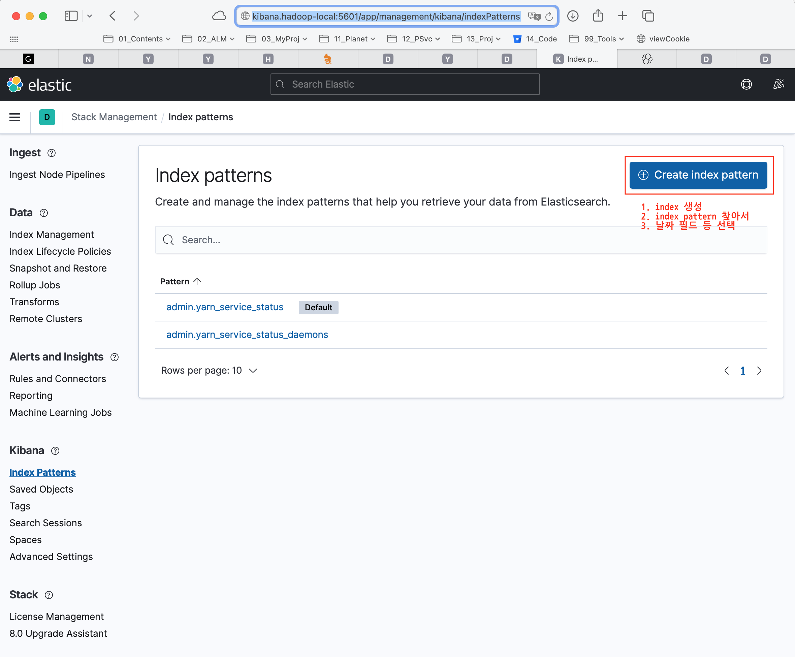
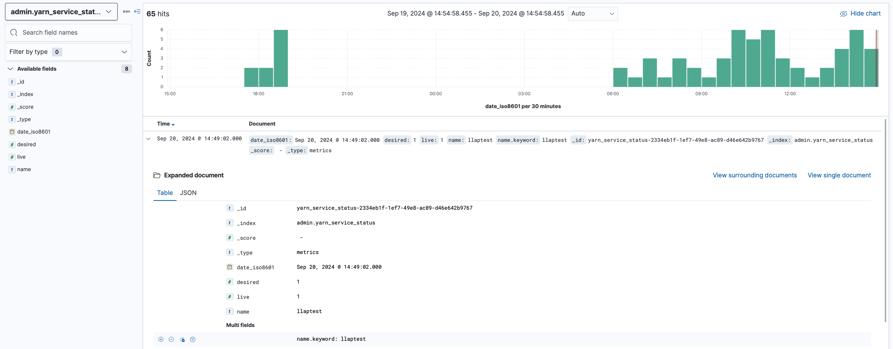
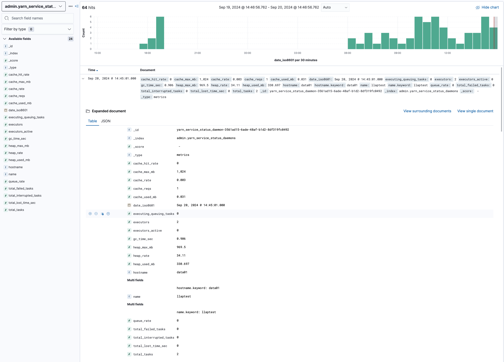

## es / kibana
### Index 생성
* http://kibana.hadoop-local:5601/app/management/kibana/indexPatterns 에서 생성

### LLAP 용 index
| Index                             | 설명 |
|:----------------------------------|:-------------------------------------------------------------------------|
| admin.yarn_service_status         | llap cluster 에 대한 desired/live node 수                                |
| admin.yarn_service_status_daemons | llap cluster 의 각 node(llap daemon)의 리소스(JVM Heap, Cache, Executor) |

* 예) admin.yarn_service_status

* 예) admin.yarn_service_status_daemons
